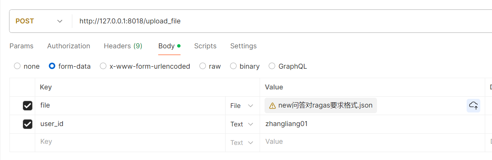

# 接口文档

## 1、上传文件

```json
http://ip:port/utils/upload_file
```

### request



### response

```json
{
    "isSuc": true,
    "code": 0,
    "msg": "Success ~",
    "res": {
        "task_id": "98f1a580-d692-4bf5-ae02-9639bbba08fa",
        "fileName": "OmegaRag-一条数据.json",
        "user_id": "zhangliang01"
    }
}
```


## 2、查询上传的文件

```json
http://ip:port/utils/retrieve_file
```

### request

```json
# 只查询上传文件
{
    "update_file": true,            # 选填
    "user_id": "zhangliang012"      # 必填
}

# 查询所有任务文件
{
    "update_file": false,           # 选填
    "user_id": "zhangliang012"      # 必填
}


# 通过任务id查询
{
    "update_file": false,           # 选填
    "task_id": "xxxxxxxxxxxxx",     # 选填
    "user_id": "zhangliang012"      # 必填
}
```

### response

```json
{
    "isSuc": true,
    "code": 0,
    "msg": "Success ~",
    "res": {
        "files": [
            "OmegaRag-一条数据.json",
            "OmegaRag-多条数据.json"
        ]
    }
}
```


## 3、删除账号下文件

```json
http://ip:port/utils/delete_file
```

### request（4种方式）

```json
# 删除所有文件
{
    "user_id": "zhangliang012"                              # 必填
}

# 删除对应任务文件

{
    "task_id": "2e324e2e-63f4-4bf4-b953-3006e4553c7e",   # 选填
    "user_id": "zhangliang012"                              # 必填
}

# 删除对应名称文件
{
    "file_name": "xxxx",                                 # 选填
    "user_id": "zhangliang012"                              # 必填
}

# 删除对应文件
{
    "task_id": "2e324e2e-63f4-4bf4-b953-3006e4553c7e",   # 选填
    "file_name": "xxxx",                                 # 选填
    "user_id": "zhangliang012"                              # 必填
}
```

### response

```
{
    "isSuc": true,
    "code": 0,
    "msg": "Success ~",
    "res": {
        "del_file_nums": 2
    }
}
```


## 4、获取omega的回答和上下文

```json
http://ip:port/ragas/getOmegaRag
```

### request

```json
{
    "task_id": "98f1a580-d692-4bf5-ae02-9639bbba08fa",                                  # 必填
    "user_id": "zhangliang012",                                                         # 必填   
    "file_name": "OmegaRag-一条数据.json",                                               # 必填
    "rag_url": "https://192.168.12.188:37778/api/v1/chat/completions",                  # 必填
    "rag_authorization2": "Bearer xxxxxxxx",                                            # 必填
    "rag_cookie": "token=xxxxxxxxxxxx",                                                 # 必填
}
```

### response

```json
{
    "isSuc": true,
    "code": 2,
    "msg": "任务已开启~",
    "res": {}
}
```


## 5、查询omega状态

```json
http://ip:port/ragas/query_omega_evaluate
```

### request

```json
{
    "task_id": "98f1a580-d692-4bf5-ae02-9639bbba08fa",       # 必填
	"user_id": "zhangliang012"
}
```

### response

```json
{
    "question": [
        "开机报错其他错误码"
    ],
    "answer": [
        "对于“开机报错其他错误码”的情况，xxxxxxxxx"
    ],
    "contexts": [
        [
            "\n开机报错其他错误码\n（1） 首先重启机顶盒、恢复出厂。xxxxxxxxxx"
        ]
    ],
    "ground_truth": [
        "（1） 首先重启机顶盒、恢复出厂。（2） 仍报错，提供设置界面照片和报错照片，通过综调报送省电视值班协查。"
    ]
}
```


## 6、通过ragas评分

```json
http://ip:port/ragas/ragas_evaluate
```

### request

```json
{
    "task_id": "98f1a580-d692-4bf5-ae02-9639bbba08fa",       # 必填,需要与omega 的task_id一致
    "user_id": "zhangliang012",                              # 必填
    "model": "qwen2-72b-instruct",                           # 选填
    "base_url": "http://120.222.7.146:1025/v1",              # 选填
}
```

备注：如果上传的文件符合ragas最终输入，可直接传”file_name“参数，无需经过 ”http://ip:port/ragas/getOmegaRag“接口

### response

```json
{
    "isSuc": true,
    "code": 2,
    "msg": "任务已开启~",
    "res": {}
}
```


## 7、查询ragas状态

```json
http://ip:port/ragas/query_ragas_evaluate
```

### request

```json
{
    "task_id": "98f1a580-d692-4bf5-ae02-9639bbba08fa",      # 必填
    "user_id": "zhangliang01"                               # 必填
}
```

### response

```json
# 任务进行中
{
    "isSuc": true,
    "code": 2,
    "msg": "ragas 任务进行中~",
    "res": {}
}

# 任务完成
返回二进制文件流
```


# 备注：

## 使用流程1、

步骤一，调用上传文件接口；

步骤二，如果上传文件只包含“question”和“ground_truth”，“answer”和“contexts”为空，则调用 http://ip:port/ragas/getOmegaRag 接口；

步骤三，通过查询omega状态，显示步骤二完成以后，调用 http://ip:port/ragas/ragas_evaluate 接口；

步骤四，通过查询ragas状态，获取最终的评估xlsx文件。


## 使用流程2、

步骤一，调用上传文件接口；

步骤二，如果上传文件“question”，“ground_truth”，“answer”和“contexts”均不为空，直接调用 http://ip:port/ragas/ragas_evaluate 接口；

步骤三，通过查询ragas状态，获取最终的评估xlsx文件。


在liunx部署是需要添加环境变了 "export OPENAI_API_KEY=None"